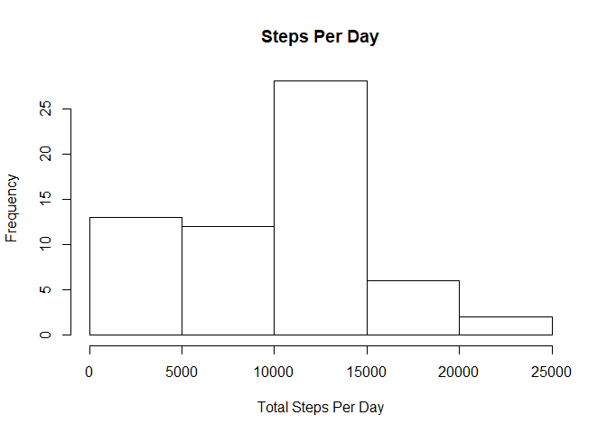
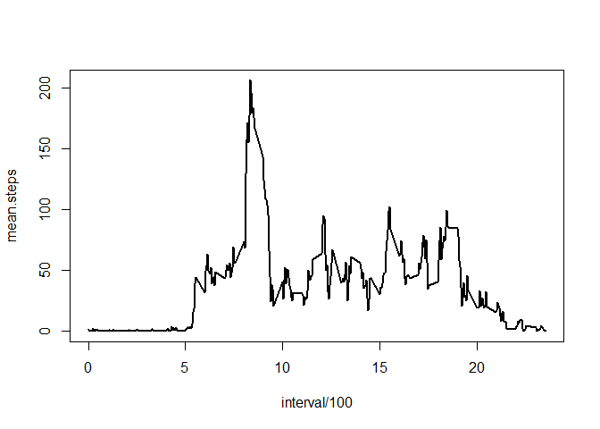
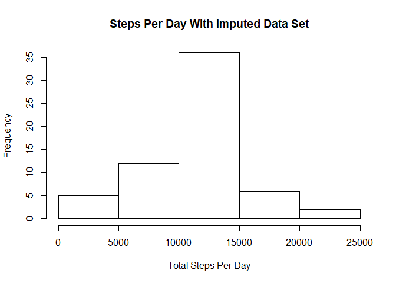
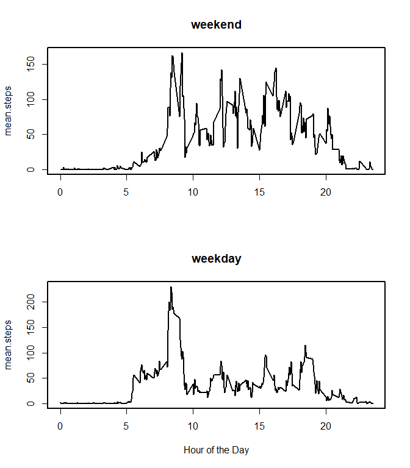

## Load libraries


```r
lapply(c("dplyr","lubridate"),require,character.only=T)
```

## Loading and preprocessing the data


```r
steps <- read.csv("activity.csv")
```

Convert date column from factor to date object.


```r
steps$date <- ymd(steps$date)
```

## What is mean total number of steps taken per day?

Create new table with sums of step numbers on each day.
Calculate median and mean values for these daily step counts.


```r
stepstot <- group_by(steps,date) %>%
      summarize(total.steps = sum(steps,na.rm=T))

meansteps <- round(mean(stepstot$total.steps))
mediansteps <- median(stepstot$total.steps)

hist(stepstot$total.steps,
     main="Steps Per Day",
     xlab="Total Steps Per Day")      
```

<!-- -->

The mean step number is 9354.
The median step number is 10395.

## What is the average daily activity pattern?

Create new table with mean values at each time of day, omitting NA values.
Find the max mean step count during an interval and convert it to a hour-minute-second format.


```r
stepsdaily <- group_by(steps,interval) %>%
      summarize(mean.steps = mean(steps,na.rm=T))

maxinterval <- hm(
      stepsdaily$interval[
      which.max(stepsdaily$mean.steps)]/100)
```


```r
with(stepsdaily,
     plot(interval/100,
          mean.steps,
          type="l",
          lwd=2))
```

<!-- -->

The most active interval of the day occurs at 8H 35M 0S.

## Imputing missing values

Count missing steps, and use a left join to create column with average number of steps in each interval.
Replace NA step values with value from the average column.


```r
MissingCount <- sum(is.na(steps$steps))

steps_joined <- left_join(steps,stepsdaily,by="interval")

steps_joined <- within(steps_joined, steps[is.na(steps)] <- 
           round(mean.steps[is.na(steps)]))

stepstot_imputed <- group_by(steps_joined,date) %>%
      summarize(total.steps = sum(steps,na.rm=T))

meansteps_imputed <- mean(stepstot_imputed$total.steps)
mediansteps_imputed <- median(stepstot_imputed$total.steps)
```


```r
hist(stepstot_imputed$total.steps,
     main="Steps Per Day With Imputed Data Set",
     xlab="Total Steps Per Day")   
```

<!-- -->

There were 2304 missing interval step counts.

With the imputed data set, the mean step number was 1.0766\times 10^{4} instead of 9354.  
The new median is 1.0762\times 10^{4} instead of 1.0395\times 10^{4}.

## Are there differences in activity patterns between weekdays and weekends?

Use wday command from lubridate to output weekday values as a number 1-7, and convert these numbers to TRUE if a weekday or FALSE if a weekend.

Calculate interval interval mean step counts for weekend and weekdays seperately, using group_by and summarize.


```r
steps_final <- mutate(steps_joined,weekday = as.numeric(wday(date))<7 & as.numeric(wday(date))>1)

stepsdaily_final <- group_by(steps_final,interval,weekday) %>%
      summarize(mean.steps = mean(steps))

par(mfrow = c(2,1),lwd=2)
with(stepsdaily_final[!stepsdaily_final$weekday,], 
     plot(interval/100,
          mean.steps,
          type="l",
          main="weekend",
          xlab = ""))
with(stepsdaily_final[stepsdaily_final$weekday,], 
     plot(interval/100,
          mean.steps,
          type="l",
          main="weekday",
          xlab="Hour of the Day"))
```

<!-- -->
